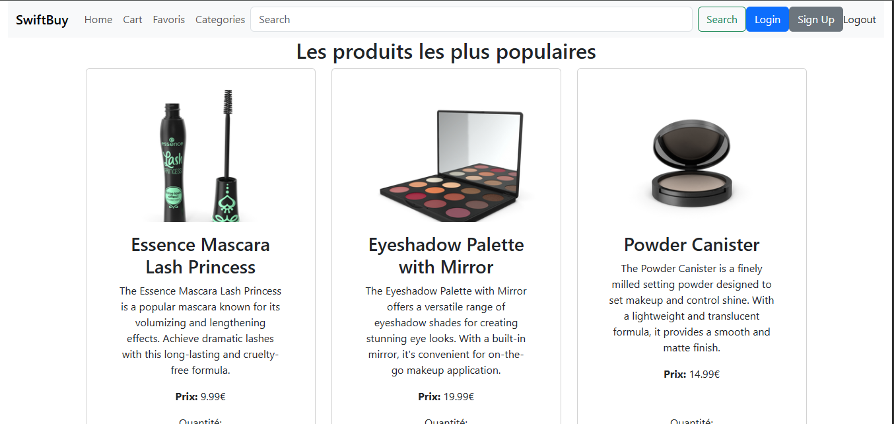
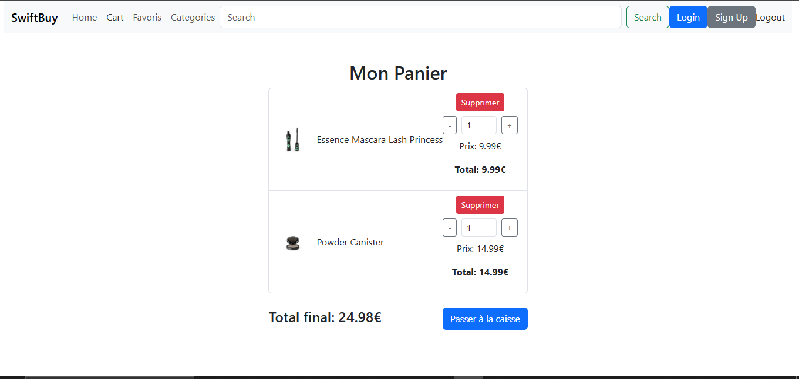
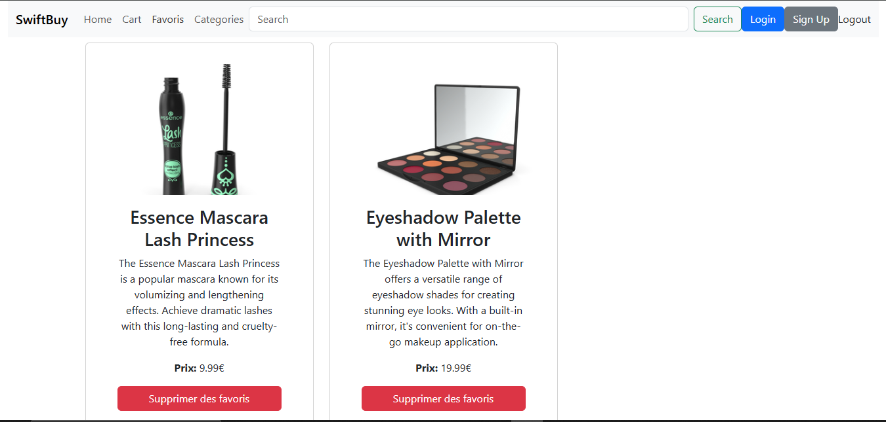
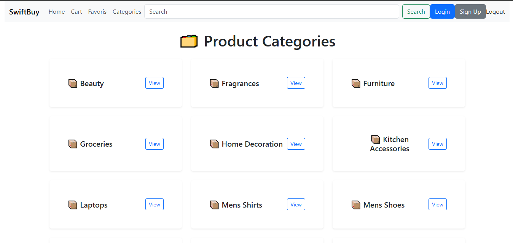
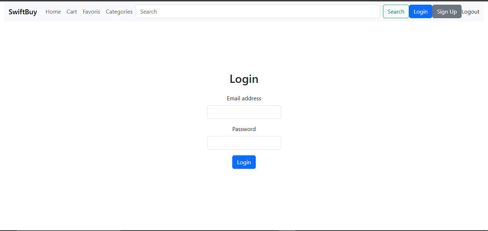
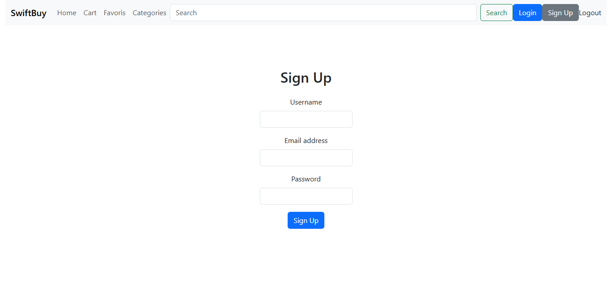

# SwiftBuy
SwiftBuy est une application e-commerce offrant une expérience d'achat. Développée avec React.js et Bootstrap, elle intègre l'API DummyJSON pour des données produits réalistes.

## Home Page
Explorez une large gamme d'articles dans des catégories comme Beauté, Électronique, Mode, etc.

## Description Produit
Consultez les descriptions, prix et images avant achat.

## Panier
Ajoutez, retirez ou ajustez les quantités avec calcul automatique du total.

## Favories
Enregistrez vos produits préférés pour y accéder rapidement.

## Categories
Parcourez facilement les différentes catégories de produits (Beauté, Électronique, Mode, etc.)

## Products Categories
Visualisez tous les produits disponibles dans chaque catégorie

## Login

## Sign up

# Technologies Utilisées
Frontend: React.js (avec React Router pour la navigation)

Stylisation: Bootstrap (pour une interface responsive et moderne)

API: DummyJSON (données produits simulées)

State: Context API

# Améliorations Futures
💳 Intégration de paiements en ligne (Stripe/PayPal)

🔍 Moteur de recherche avancé avec filtres

⭐ Système d'avis et notations clients

🚚 Suivi de commandes en temps réel

# Installation
npm install

npm start

Accéder à http://localhost:5173/
